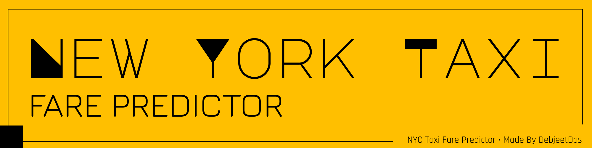
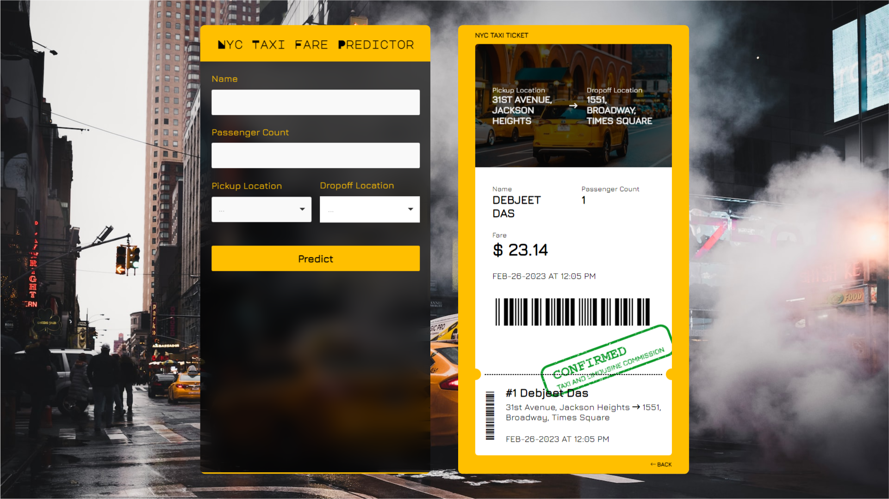

<!-- # <strong style="color:#ffffff;">Digit</strong>Recognizer. -->

  

NYC Taxi Fare Predictor using Linear Regression, check it out... 👇👇 
Made in python, django, HTML, CSS, jquery, and ajax.

NYC Taxi Fare Predictor is a WEB application that generates an NYC Taxi ticket by predicting the taxi fare using simple Linear Regression.
 
<!-- Website: https://dasdebjeet.github.io -->

## How to setup

Clone the project:

    git@github.com:dasdebjeet/nyc_taxi_fare_predictor.git

## How to run Python script

To install all the requirements for the project run

	pip install -r requirements.txt

In the app_V1 directory. After the modules have been installed you can run the project by using python

	django-admin manage.py runserver

 

  

## How to use the app

After opening the application

1. Give the name of the passenger in the **Passenger Name**
2. Give the number of passengers going to travel in the **Passenger Count** *(0 < passenger count <= 5)*
3. Then give the pickup location and dropoff location in the **Pickup Location** & **Dropoff Location** respectively
4. After giving all the inputs click on the Predict button and wait patiently while your Ticket is generated

 

 

 *Hola! Enjoy the ride...*

 

**Made with </> by <a href="https://dasdebjeet.github.io">DebjeetDas</a>. © 2023 all rights reserved.** 
*Author: Debjeet Das*
